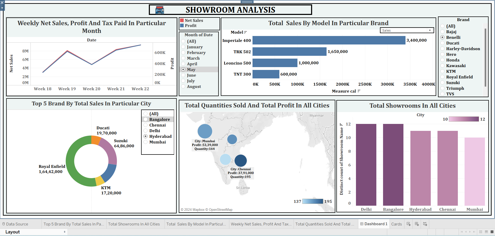

# 📊 Showroom Sales Analysis Dashboard

## 📌 Overview
This project analyzes showroom sales data using an interactive dashboard to understand profit, tax, sales trends, and performance across different cities and brands.

---

## 🎯 Objective
- Analyze sales and profit performance  
- Identify top-selling brands and models  
- Understand city-wise sales distribution  
- Support data-driven business decisions  

---

## 🛠️ Tools & Technologies
- Tableau / Power BI  
- Excel  

---

## 📊 Dashboard Features
- Sales and profit visualization using charts  
- Tax and revenue analysis  
- City-wise and brand-wise performance tracking  
- Interactive filters for detailed insights  

---

## 📈 Key Insights
- Identified top-performing brands and cities  
- Highlighted trends in sales and revenue  
- Helped in understanding customer demand patterns  

---

## 📷 Dashboard Preview

---

## 🚀 Outcome
This dashboard enables better decision-making by providing clear insights into sales performance and trends.

---

## 🔗 Live Portfolio
https://chetnanaik02.github.io/portfolio/

---

## 👩‍💻 Author
Chetna Naik  
Data Analyst
